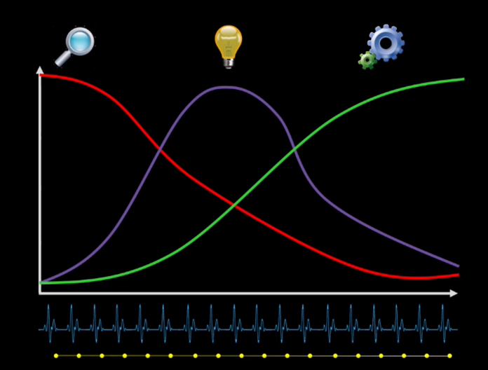
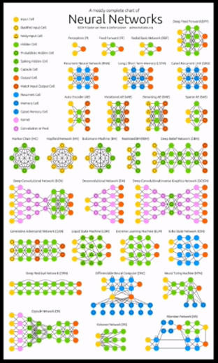
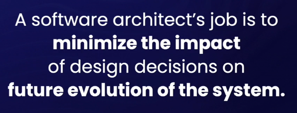
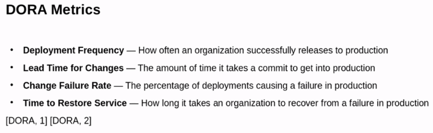
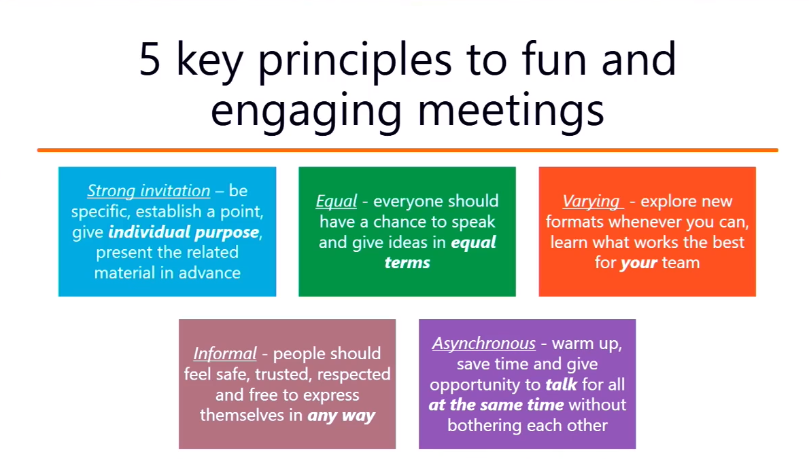
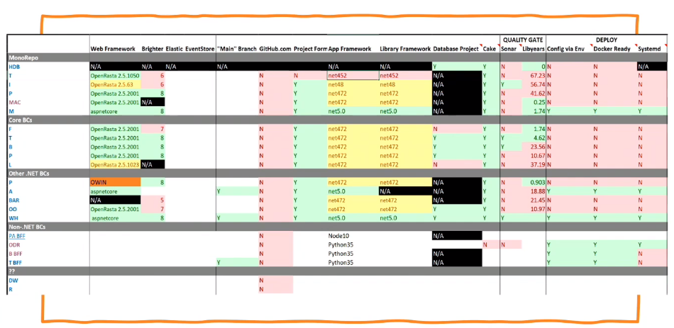
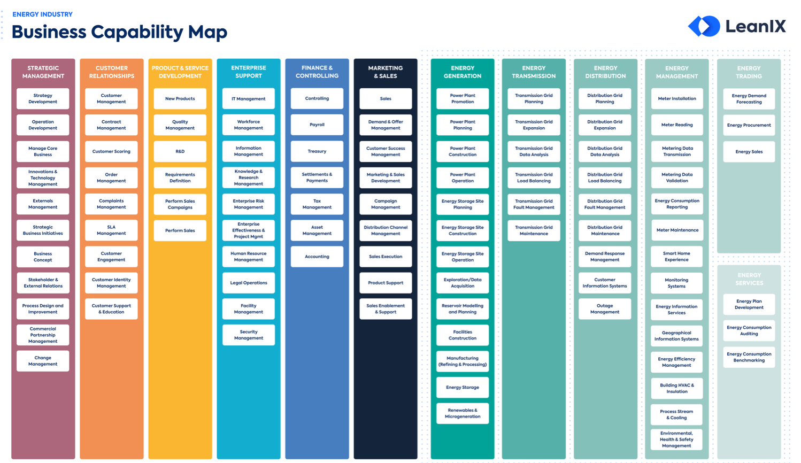

# Build stuff

# The future of software engineering

red - architectural decisions
green - all design decisions

Neural network design pattern

 - bringing in new stuff think about:
   - doe sit replace what you have? trim your stack
   - supported? by whom, for how long, actively?
   - is built to solve the problem you have? too heavy?
   - is team familiar willing to learn the new stuff?
     - try avoiding combining learning & delivery (in other words budget learning time, as it will take time)
     - do 1 at a time
     - reality check, can you explain business why this is needed.

People buy into the leader before they buy into the vision.

juniors should talk first in discussions.
efbundle runnable package to execute mgirations and prepare database

 - You cannot predict the future, a roadmap is more of a map with many routes. What is important is having a direction and understand it. Consider multiple routes, multiple possibilities.
 - you cannot prioritise by business value, because you don't know what it is or what value it has because you cannot predict future. Say what it is, a requirement that client currently things is important, an estimation, etc.
 - distributed system, a system where a broken computer you didn't know existed caused your computer to break.

 - L: if you are a person who doesn't take on financial debt and wait to save money and only then buy it when you can afford it, something like that will happen with development as well. HOWEVER! Not taking on debt doesn't mean putting in more effort into writing clean code or using more engineering patterns. What you do when you don't have money but stand in a shop? You don't buy anyhing and walk out. Same with development. You probably don't develop anything and wait to either think more about design to have a better solution with could afford to solve the problem, or wait for more information to better understand a problem.
 - As a human you are able to work with incomplete knowledge, but you have to be aware it's an estimation and expect changes.
 - 
 - strangler pattern: take a small piece out and let it grow, eventually outgrowing the old solution.
 - 
 - sam newman - zoom in buildstuff "microservices is a last resort. Start with analyzing problems of current architecture."
 - Sam Newmans on zoom: people should be allowed to learn during work time, doing it during free time is not sustainable.
 - L: How csharp f-ed up nullable, value type vs ref type with nullable project enabled. That table. ? operator means different things based on target type.
 - don't trust edge code of nullable projects, everything is null for DTOS
 - 
 - architecture (at least partially) should be consistens in the company between all components (microservice or otherwise).
 - term: business capabaility mapping.
 

Watch:
  - [ ] Orcehstration & Choreography
  - [ ] Angels & Devils cocktail
  - [ ] 12 factor cloud develop
  - [ ] 
