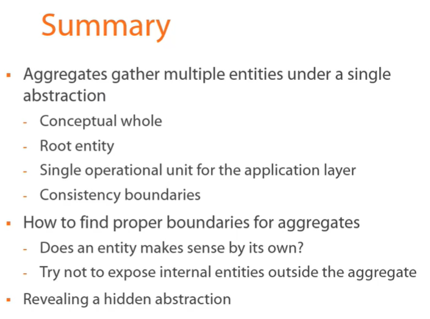

# Domain-Driven Design in Practice

This is a cource on how to apply [[Domain-Driven Design]] in practice.

DDD is not a [[silver bullet]].
Software project has attributes:
 - amount of data
 - performance
 - business logic complexity
 - technical complexity

DDD is only applicable in projects with high business logic complexity.

The tone of the speaker is a bit monotone.

Promotes [[YAGNI]] and [[KISS]].

Interesting graph on tackling complexity. I think this could be elaborated on different ways the line moves over time. It could go up quickly and do descends, which would mean refactoring. This would be ideal for cases where you cannot forsee the possible complexity. There is no need for radical simplification if the object is not complex in itself.

Main conepts (strategy):
 - [[Ubiquitous language]]
 - [[Bounded context]]
 - [[Core domain]] - focus on the most important part of the system.

(!) explains the importance of ubiquitous language and having a single term for a single thing, then proceeds to provide multiple definitions for a same thing that are used interchangeably. 😄

Developer should strive to become domain expert as well. This is often not true as developers are attracted at technical issues and the knowledge it brings, as it is reusable. Domain knowledge is probably not transferable, but it will improve your journey on searching solutions or simplifying problems. It also teaches you to tackle new knowledge and domains faster.

[[Onion architecture]]

 - It's dangerous to be too eager to look for abstractions as finding correct abstractions is usually pretty hard and having incorrect abstractions is worse than having no abstractions, especially when more places start using the incorrect abstraction.
 - (?) Don't introduce several bounded contexts upfront. Is the idea to model domain as a single bounded context and then extract bounded contexts. Or did he mean to tackle each bounded context one by one?

Types of equality:
 - [[Identifier equality]]
 - [[Reference equality]]
 - [[Structural equality]]

[[Value object]] 
    - doesn't have a lifespan on its own. It only exists within an entity.
    - structural equality
    - 

Vladimir states that VOs don't have a table in persistence database. I'd say it should be formed as in VOs don't have to have tables in persistence. But having a table on their own wouldn't necessarily conflict with definition of a VO?

- Add most of the logic into value objects.

- Base `abstract class` vs `interface`: one is-a other can-do.

[TDD] can have two modes:
 - test-first: for when we know very clearly what the system has to do.
 - code-first: for when we are exploring and experimenting the solution.

(?) Expresses pretty strong opinion on VO not having a separate table. But in my mind that is implementation details and doesn't matter for as long as ORM can handle it without bleeding implementation details into domain layer. EF can do that, id would be a shadow property and handled by EF only.

What I call use case, he calls interaction of user with the application. So a button click is a separate transaction and it performs a use case or an interaction.

(!) permanent references should be to aggregate roots only, temporal references (local variables) can be to entities. Even then it should be done via the aggregate. The idea is that you don't want to open up a possibility to break aggregate invariants.

(!) can a entity live without aggregate root entity? then it's probably an aggregate of its own.

(!) aggregate with many entity instances might indicate that there should be a separate aggregate for all those entities (1-to-many should rather be 1-to-some).
(!) try to hide internal entities from outside of an aggregate. 

[[OOP]] is more rigid than [[Procedural programming]] encapsulating, classifying and grouping data might help to tackle the complexity in logic. But the abstractions you have and the more they interact and depend with one another, the harder it is to change them. (thoughts inspired by Linus Torvalds).

(?) he had a freedom of changing and introducing new value objects based on exploration in code to reduce complexity. In a context of us being in a different domain it would be harder to introduce new value objects if we had to first agree on them with the other team. WHat is the approach, do we allow ourselves to introduce new value objects? THis is a generic question without a particular context right now.

[[Emergent behavior]] having unit tests sometimes is enough to cover specific business requirements when they are emergent from other rules. Ex. there cannot be a slot with negative number -> when you buy from slot with 0 you try to change it to negative -> error. In this case you might want to add explicit check for a nicer error message. Or maybe throw a nice error message to begin with (instead of cannot be -1, it the error could be the slot is empty).

[[Aggregates]]

 Repository per aggregate

 
 (!) If we use repository and unit of work patterns, then repositories should not contain `.Save()` method, unit of work should handle that. Repository in those cases conceptually is just a collection.
    I'd like to force using unit of work by hiding the save method in repo.

(?!) specific repository methods as an interface, so it would be easier to mock them (tests/or during development) or use different implementations without impacting domain layer.

(!) Reference data, basically persisted enums that are actually aggregate roots (prob could be entities). In other words, data that only changes when data schema changes.

Bounded context seperates model into smaller ones. [[Divide and conquer]] principle. Also boundaries for ubiquitous Ubiquitous language simillar to namespaces in c#.

sub-domain -> problem space
bounded context -> solution space

bounded context goes through all layers of onion architecture.
bounded context shouldnt be too big (not too much code), generally it should fit in your head.

sub-domain -> hr part like ordanisational data
bounded context -> our apis
bounded context -> HCM Oracle part with UI etc.

shared kernel bethween bounded contexts.

anti corruption layer protects bounded context concepts from bleeding into another.

Isolation types:
    1. Same assembly, separate namespaces (same database, different schemas)
    2. same solution, separate assemblies
    3. separate deployments

greater isolation -> Easier to maintain proper isolation -> bigger maintenance overhead

YAGNI, start with 1, move to other as needed.

Communication:
    1,2. in-process, method calls, domain events.
    3. network call, http, message, etc.

Code reuse:
    - busines logic -> unless completely the same, don't share between BC.
    - domain base classes -> same team, good, different teams, bad.
    - utility code, reuse within same team. share as package only when provides a lot of value.

Domain event - important to domain
System event - technological, infrastructure events.

domain events try to 
 - contain as little data as possible.
 - use primitive types (not entity models)
 - include ids if BCs are in contact already, if listener is not aware of producing BC, then include all needed information.

delivery:
    - in process separation -> in memory structures
    - separate deployments -> service bus (network message)
    - (!) domain event creation is responsibility of domain
    - event dispatch is responsibility of infrastructure
    - 

