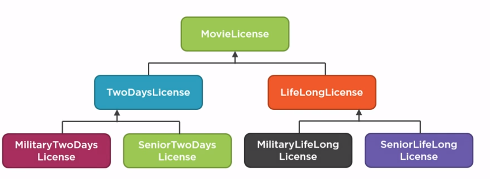
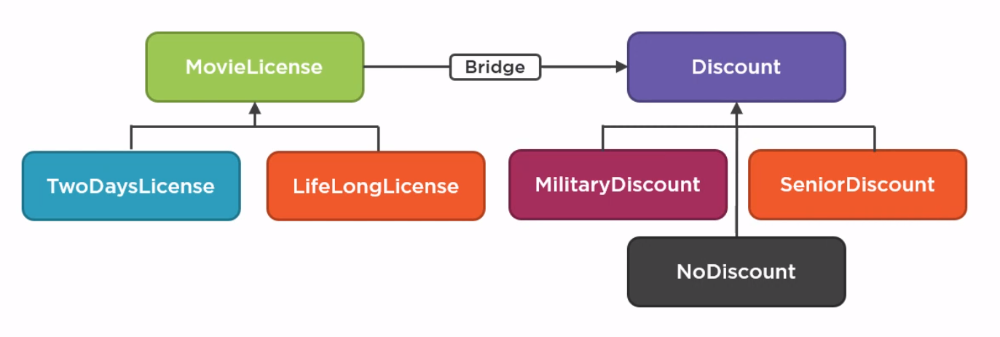
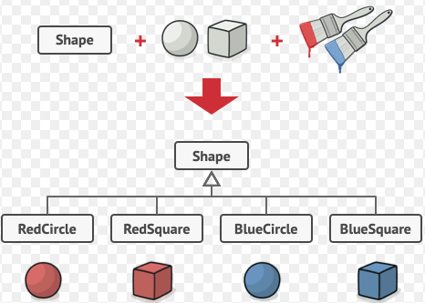
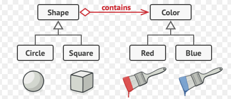

# bridge design pattern

I'm not sure if vladimir kharikov interprets bridge pattern correctly. His interpretation is basically equivavlent to template methods vs strategy pattern.

I believe gang of four described bridge pattern as spliting abstractions and implementations so that they can vary independently for a reason. It is same as strategy pattern, but bridge pattern exists to show that strategy pattern can be applied of abstractions.

But partially they are the same? 

Maybe the bridge pattern is just a pattern of connecting two concepts in one place? The implementations, boxes and their relations together can be whatever.

"Abstraction" is a "concept". Ex. shape. Shape is abstract, but it's a concept of multiple its own "implementations", circle ands quare are types of shape. While the actual implementation of making it real, i. e. drawing it are implementations in bridge and can be different as well.

So we separate conceptual from actual?

Divide and conquer is applicable as is in most of other things. 

The difference between bridge and strategy patten is mostly the reason you are applying it for:
you needed to add changeable behaviour based on context type: you choose between template methods and strategy pattern. You went with template methods. Eventually you have too many classes. You apply bridge pattern to split your inheritance tree, now you have a strategy pattern.

Strategy pattern is meant for behaviour, while bridge pattern is meant for structure.
