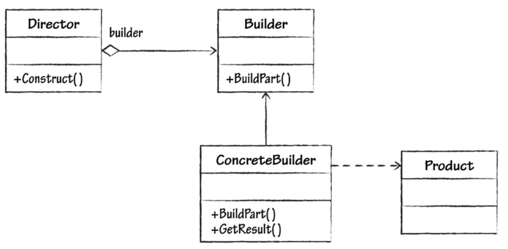

# builder design pattern

 - Extracts creation code from representation.
 - Divides creation into distinct steps.
 - Exact type to be built is not known by the director. Or maybe that is more [[factory design pattern]].

ℹ️ Not all builders have to have a fluent version.

ℹ️ Not everything is solved by builder pattern. Consider what can you refactor, introduce subclasses, abstract interfaces, or otherwise decompose difficult object.

