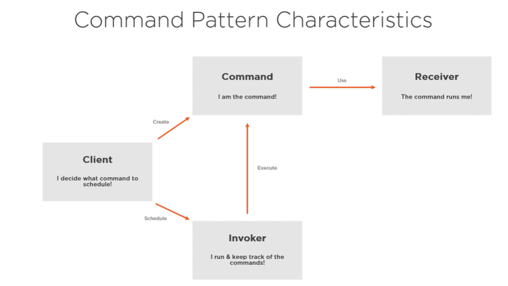

# command design pattern

Command, Receiver, Invoker, Client

A command contains all the data to process the request now or at a later time.
This is important given different contexts: internal commands, external commands between services, transactional contexts, etc.

benefits:
 - delayed exec (ex a bulk)
 - undo/redo functionality (command manager/invoker keeps a stack of executed commands)
 - reusability for different inputs adapters (api, wpf, console, etc.)
