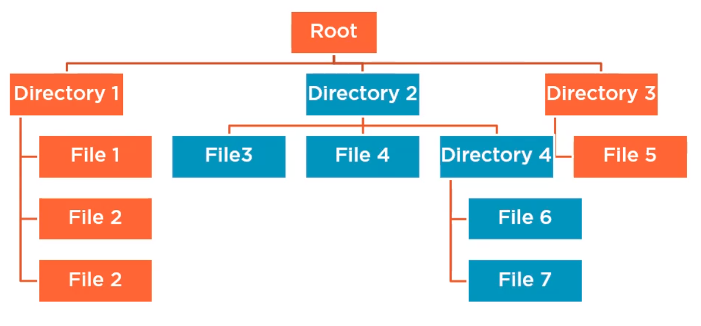
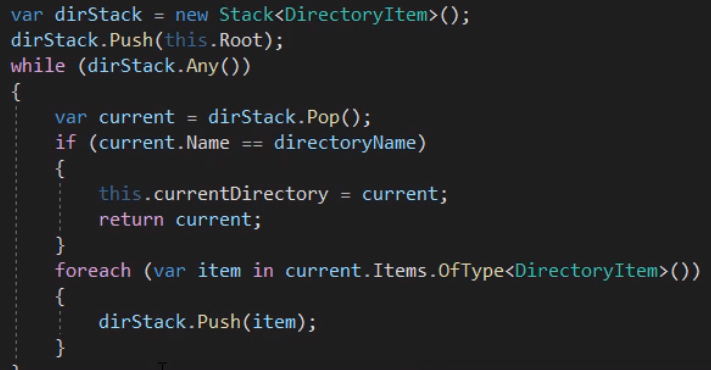

# composites design pattern

Composite objects into tree structures, ex. file system, to manipulate multiple objects in hierarchical structure with aggregate operations that recursively execute down the tree.

 - Component is a common interface including primary operation(s).
 - Composite is a component with children.
 - Leaf is a component without children.

ℹ️ Possible variations. `.Add` and `.Remove` operations might be part of `Component` interface, but then `Leaf` has to throw. Alternative could be `Composite : Component` interface, or just the concrete class implementing each its own methods.

ℹ️ Consider using a [[builder design pattern]] to simplify initialization. 

Navigating composite or tree in general can be done using recursion or an iterative approach with stack, ex.:

