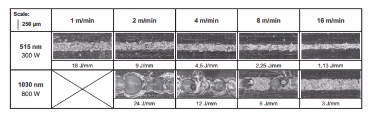

# AILU System Engineering for Laser Manufacturing in e-Mobility

https://www.ailu.org.uk/event/system-engineering-for-laser-manufacturing-in-e-mobility-webinar/

9.00 – 9.10:   Welcome & Introduction
Dave MacLellan, AILU (UK) & Hans-Joachim Krauss, blz (Germany)

9.10 – 9.30:   An overview of laser applications in the e-mobility sector
Paola de Bono, TWI (UK)
     - ensuring quality welding battery packs
     - joining disimmilar materials
     - thermal cooling
     - works with bmw, fort, toyota, honda, jaguar, landrover
     - edge welding with wobbled beam
     - temperature testing, to avoid stepping over threshold
     - Galvo scanner on a robot hand. Need a good abstraction of transforms, something like Unity.
     - laser head on a railway sort off, for building large structures like aero planes, etc.

9.30 – 9.50:   Research on colour and shape: How basic features affect laser manufacturing in e-mobility
Markus Müller, Bayerisches Laserzentrum (Germany)
    - humping on seams
    
    - porous seam, leaking, short circuits for conductors.
    - 
    - colors can help with head absorption, reduce risk of overburning, less energy, more speec, deeper cuts.
    - 
    - Premelting material with red laser and then welding with green.
    - Postweld processing to slow down cooling
    - 
    - local position oscilation according to sin wave combined with power oscilation synhronized with position (pulses seemed to provide better results still)
    - 
    - Welding in shapes, like brushes, with positional oscillation.
    - changed donut shape of the actual beam
    - 
    - 
    - 
    - don't cross the beam, or do

9.50 – 10.10:  Welding dissimilar metals with fibre lasers
Jack Gabzdyl, TRUMPF Laser UK (UK)
 - nano pulses join pretty much any material, with limiting thermal melting and aboid intermetal generation, etc. minimal mixing
 - 
 - 
    using scanners
 - 
 - Sprial ^^^
 - Rapid solidification, metals don't mix, inhomogenuous, no intermetallic combounds
 - TruPulse 2020nano
 - 
 - 
 - 

10.10 – 10.30:  Laser bonding for battery & SiC power electronics
Manfred Fischer, Strama-MPS Maschinenbau & Jeffrey Hill, FK DELVOTEC (Germany)

10.30 – 10.50:  Production solutions for EV applications
Simon Carlyon, IPG Photonics (UK)
 - wobble allows to span gaps up to some milimeters

10.50 – 11.10:  Diagnostics and in-process assembly control using Artificial Intelligence
Krste Pangovski, Vision Intelligence (UK)
 - quality assurance used on humands as well
 - Recognises state in process
 - cascading multisomething neural networks
 - system picks up when each step was done if anything was missed.
 - basically works on visuals
 - detects best practices and propogates to other workers
 - generate historyline for production to find where problem occured
 - 
 - station utilization
 - 

11.10 – 11.30:  Discussion & Networking
Meet delegates & presenters in topic-related Breakout Rooms (join & switch at will)

