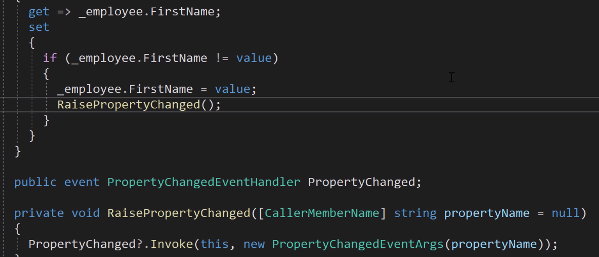

# desktop application development

Windows Forms - first framework, .net 1.0, visual designer.

WPF - second framework, .net 3.0, XAML.

WinUI in UWP - came with/for Windows 10.

WinUI in Desktop - to use new controls with XAML islands (Windows 10).

MSIX is a package to distribute your application.

----------
Fundamentals of Building .NET Desktop Applications
By Thomas Claudius Huber

[[MVVM]] is a model, view, modelview pattern.

-----

----
[CallerMemberName]

-----
x:Bind