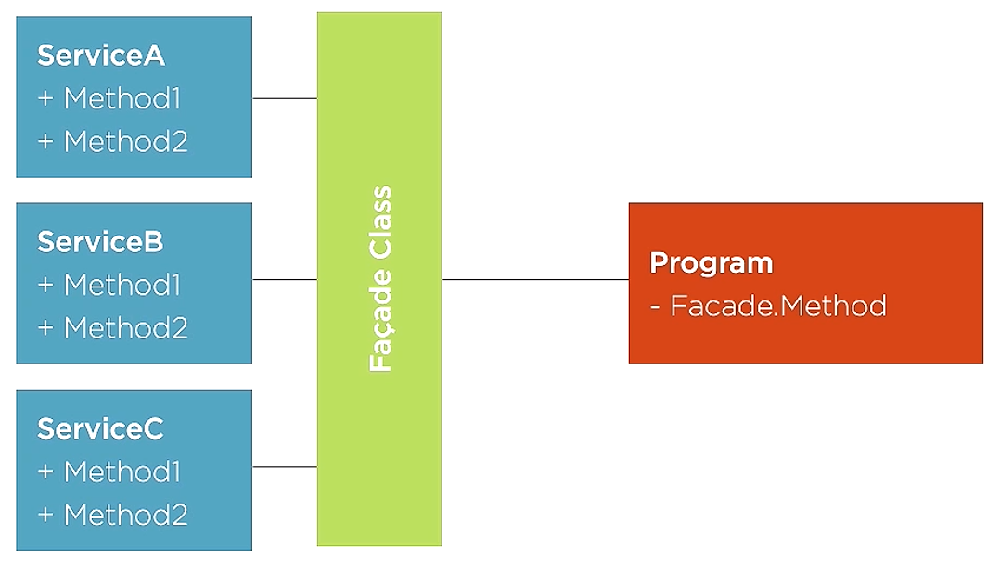

# facade design pattern

 - can be used as an anti corruption layer for big godlike or big ball of mud like classes. In other words, helps dealing with code that did not adhere to [[interface segregation principle]].
 - it can orchestrate more difficult scenarios that would otherwise include multiple calls to multiple services and knowing how a complex system works.
 
