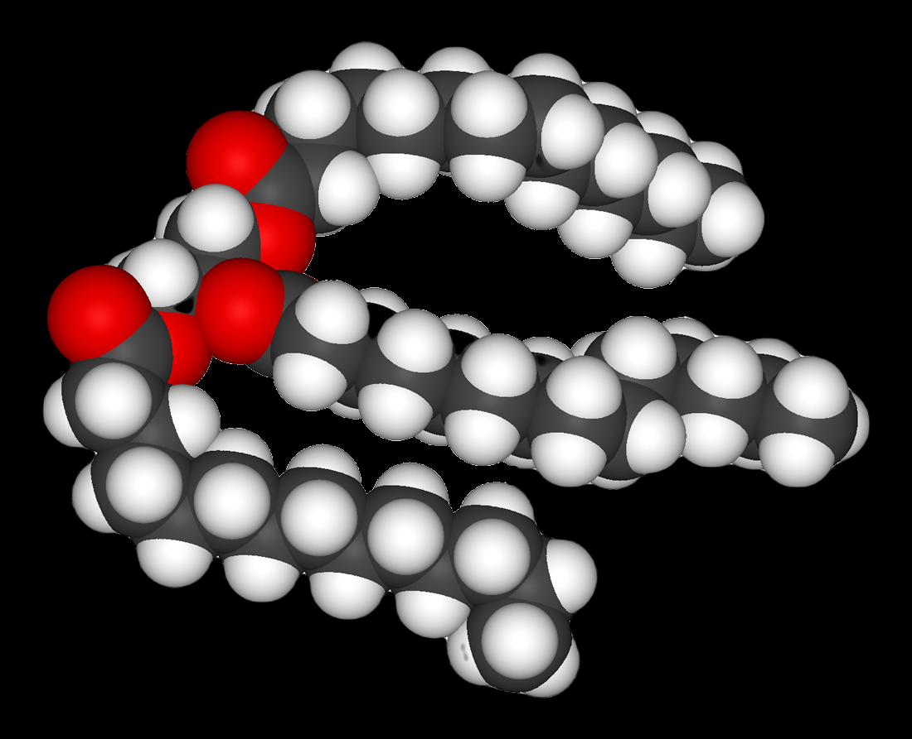
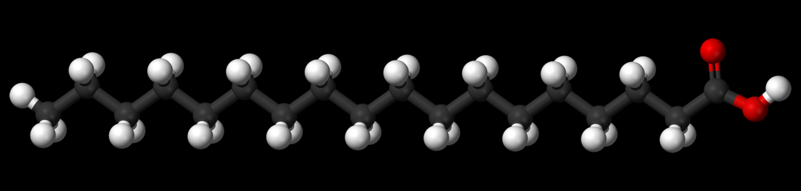

# fats

A fat is made of two kinds of smaller molecules: glycerol and fatty acids. Fats are made of long chains of carbon atoms. Some carbon atoms are linked by single bonds and others are linked by double bonds.

TODO:

   - [ ] % of monounsaturated
   - [ ] % of polyunsaturated
     - [ ] % of omega 3
     - [ ] % of omega 6
 - [ ] Cholesterol
   - [ ] Differences between LDL and HDL.

- [fats](#fats)
  - [lipids](#lipids)
  - [saturated fats](#saturated-fats)
  - [unsaturated fats](#unsaturated-fats)
    - [monounsaturated fats](#monounsaturated-fats)
    - [polyunsaturated fats](#polyunsaturated-fats)
    - [(and omega3/omega6)](#and-omega3omega6)
    - [cis and trans fats](#cis-and-trans-fats)
    - [trans fats](#trans-fats)
  - [references](#references)

Amount of fats consumed depends on person, calories, diet, etc.
I'll be aiming for 40-30-30, with 2339kcal that is 78 g of fat.

## lipids

TODO

## saturated fats

A saturated fat is a type of fat in which the fatty acid chains have all or predominantly single bonds. 

It's called saturated because connections have the maximum amount of hydrogen atoms. Each double bond in unsaturated fat removes 2 hydrogen atoms.

Lowering amount of saturated fats is only half of the story. A very important part is what is the replacement nutrient? Ex. adding more carbs to count for the lost calories isn't necessarily better. Studies (PURE) show, that replacing [[carbs]] with polyunsaturated does decrease mortality from statistics point of view.

Food sources:
- tropical oils, coconut, palm oil
- some meats: beef, pork, lamb, veal etc. (mostly except fish?) 
- high fat dairy products: cream, ice cream, whole milk
- pastries, pies, cupcakes

## unsaturated fats

### monounsaturated fats

Food sources:
- olive oil
- peanut oil
- avocados
- most nuts
  - macadamia nuts, almonds, pecans, hazelnuts, pistachios, peanuts
- most seeds

### polyunsaturated fats 

Food sources:
- ground flax and flaxseed oil
- soybeans
- walnuts
- sunflower seeds
- chia seeds
- hemp seeds

### (and omega3/omega6)

Omega number
Another classification considers the position of the double bonds relative to the end of the chain (opposite to the carboxyl group). The position is denoted by "ω−k" or "n−k", meaning that there is a double bond between carbons k and k+1 counted from 1 at that end. For example, alpha-Linolenic acid is a "ω−3" or "n−3" acid, meaning that there is a double bond between the third and fourth carbons, counted from that end; that is, its structural formula ends with –CH=CH–CH2–CH3

### cis and trans fats

Cis and trans fats
Another important classification of unsaturated fatty acids considers the cis-trans isomerism, the spatial arrangement of the C–C single bonds adjacent to the double bonds. Most unsaturated fatty acids that occur in nature have those bonds in the cis ("same side") configuration. Partial hydrogenation of cis fats can turn some of their fatty acids into trans ("opposite sides") variety.

### trans fats
- Generated during partial hydrolysis, when unsaturated fats are being transformed into saturated, but the process is not completed to reach specific properties of the final product.
- Trans fats differ very slightly, a single change of configuration in one double bond causes different chemical and physical properties:
  - Example elaidic acid is the trans isomer of oleic acid and has melting point at 45 °C (above body temperature) instead of 13.4 °C.
  - The result is trans fat molecules pack more tightly and form a solid that is harder to break apart.

## references
- 2018 Dietary fat and cardiometabolic health: evidence, controversies, and consensus for guidance https://doi.org/10.1136/bmj.k2139
- 