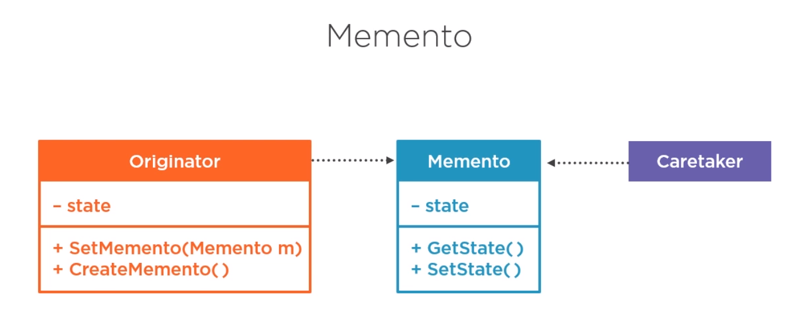
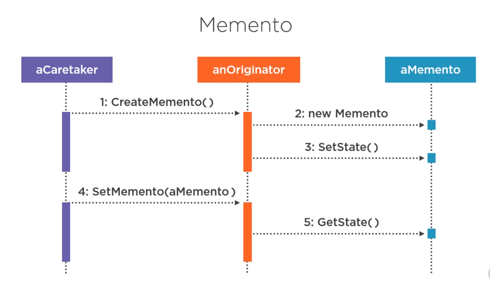
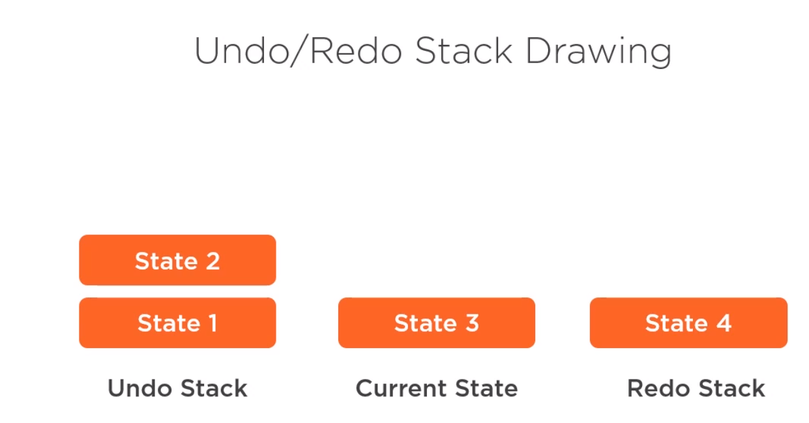

# memento design pattern

Behavioral pattern
Is memento pattern just persisted commands? Or is something more generic? It is more generic:
-> A memento hold objects internal state so that the object can be restored to this state later <-
Ex. savepoints in a game, particular commit in source control (not really, since it's deltas?), undo/redo commands, rolling back a distributed transaction (basically undo in a distributed environment).

Originator - object of which state is being tracked.
Caretaker - external object that works with originator.
Memnto - a separate type for storing originator's state.

Keep in mind:
memento should be very simple, essentially a value object.
caretaker is responsible for managing previous states
avoid leaking internal state outside of originator or memento
goes well with stack structure

might not work for stuff where memento is very big.
can be difficult to encapsulate (no friend on csharp)
 alternatives:
 - command pattern with reverse operations.
 - store diffs (deltas)
 - 

