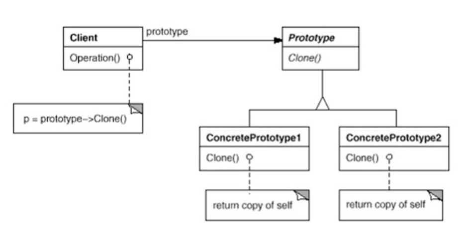

# prototype design pattern

Create objects by making clones of an existing predefined object.

:information_source: Use a manager that has a list of prototypes and serves them based on input.

:information_source: Consider using prototype pattern instead of a factory pattern when solving a problem of many properties being the same.

