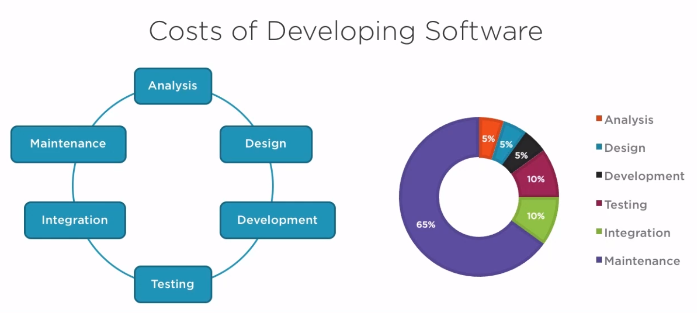
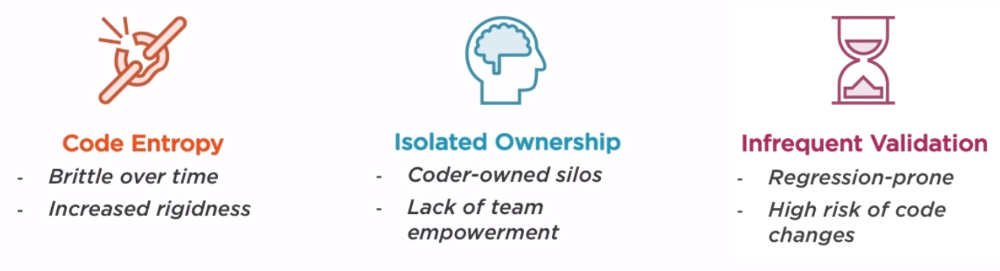
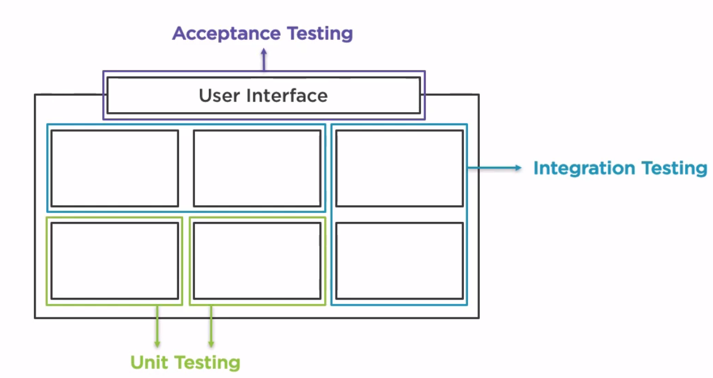
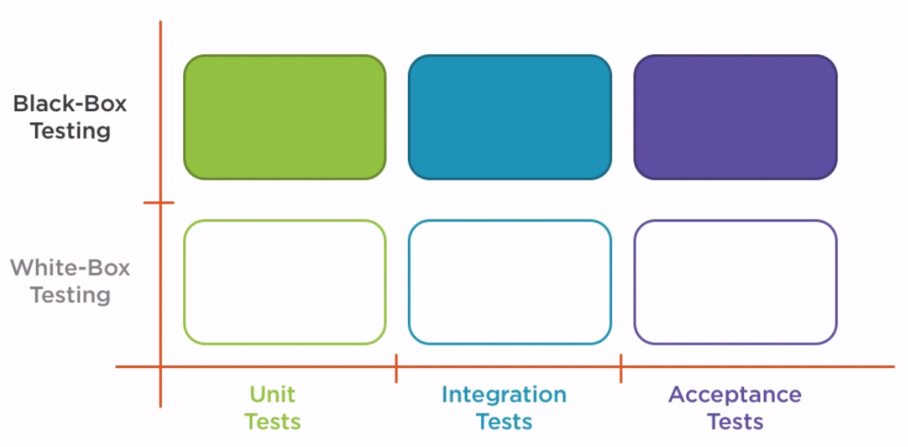
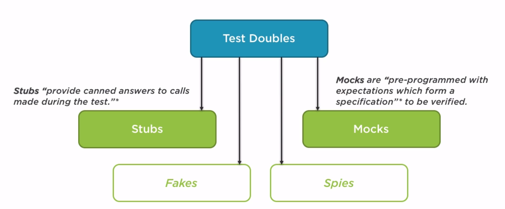
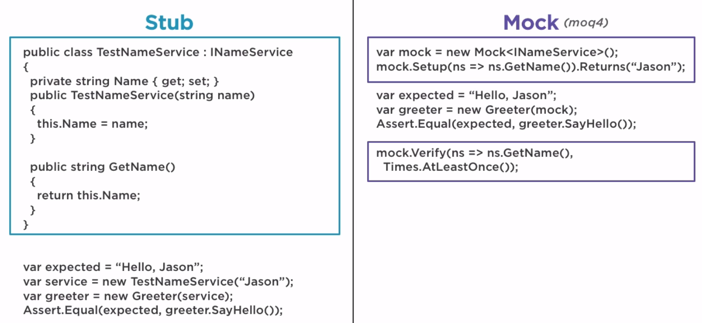
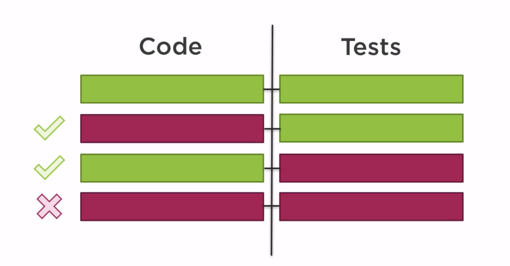

# test driven development (tdd)

Benefits:
 - Requirement verification
 - Regression testing
   - :information_source: reproduce bugs by writing tests!
 - Design-first mentality
 - Help avoiding over-engineering
 - Momentum, create in small increments
 - Confidence in refactoring, changing code

 :information_source: Acceptance test can be calling class library methods if you product is a development package.

 [[black box testing]]
 [[white box testing]]

:information_source: Continuously run test using `dotnet watch test`.

Tactics to making a RED test go GREEN:
 - fake it - add constants and gradually replace them with real code.
 - make it - if implementation is obvious write real implementation right away.
 - triangulation - only generalize solution when there are two or more examples. (why the name?)

 - Test double is like a stunt double in movies

:information_source: Execution order of tests should not matter.

:warning: Tests should focus on "what", not "how". Don't overuse Moq.

:information_source: You don't have to always write the test first. Does it make more sense to write some code first? Does it bring more value than starting with a test? Then do it.

