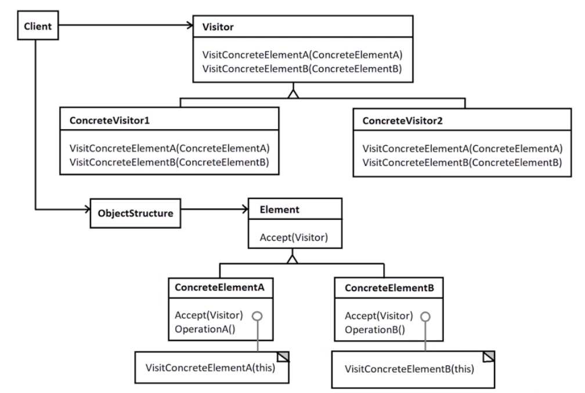

# visitor design pattern

Represents an operation to performed on object structure without modifying objects themselves.

:information_source: good for adding operation to many objects which are otherwise not related in any way.

:information_source: good for accumulating state while doing aggregative calculations and visiting many entities.

:eye: visitor is just commands and handlers for entities and visitors.

:information_source: consider using ObjectStructure for visiting/navigating your entities, ex. a tree, a list , a graph, etc.

