# Day 1

-----------------

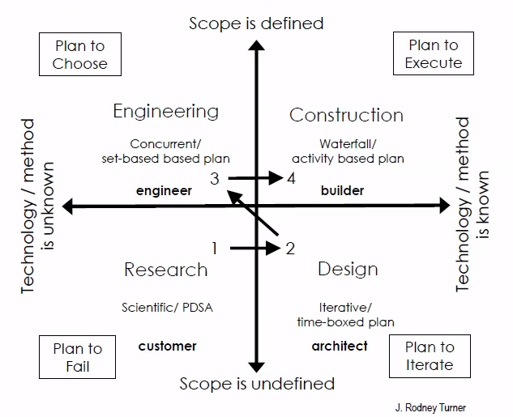

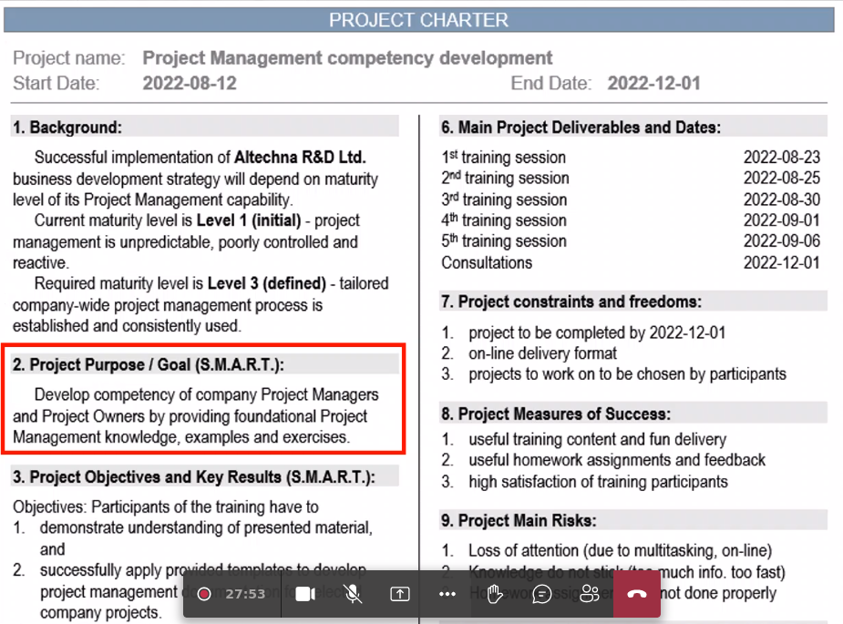

kai visi daro panašiai ir turi bendrą supratimą, gali padėti vieni kitiem, nes lengviau supranta vieni kitus.

kaip reikia vykdyti projektus?
greitai
(uh, uoj tas kapitalizmas ir ekonominės lenktynės)
[?] Ar nekuriam dirbtinio poreikio jeigu rinka jau ir taip perpildyta?

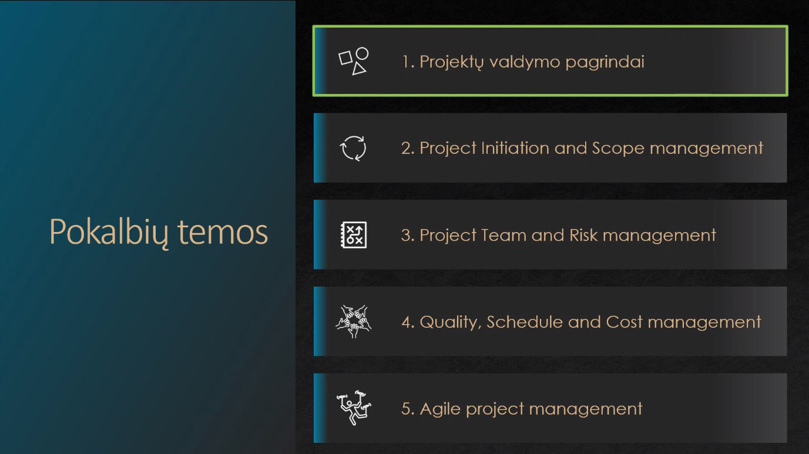

iš kur ateina motyvacija? pabandyti įžvelgti.

Quality, schedule, cost -> HAL quality + cost?

analize:
kas tai yra? kam to reikia? esmė (priežastingumas)
apibrėžimas, paskirtis ir esmė
L: skamba kaip kritinis mąstmas, see things for what they are, what their purpose is for and what is causal relationship to other things.

Kas yra projetkas?
Laikina veikla (egzistuoja deadline, rėžis), unikaliam produktui
Laikina organizacija, sukurti pokyčiui (sudden big change)
L: alternatyva[?] ilgalaikė organizacija continuous improvement pokyčiui kurti (growth)
L: expected output (type of causal relation)
Bet kas, kam reikia daugiau nei vieno veiksmo
tas, ką valdai kaip projektą

6mėn~ dalomi vienetai projekto (phases)

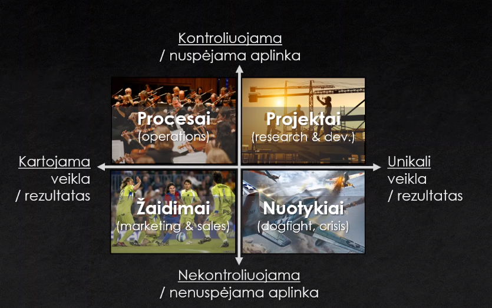

Keičiam procesus naudojant projektus (kur ta riba, kad tai reikia projekto, kada pokytis pakankamai didelis?)
(daugiau nei 2 žingsniai?)

L (!): HAL: Naujo hardware įdėjimas tampa procesu (arba bent proceso sudetingumo, t. y. atkartojama ir valdoma veikla), ne projektu (ne unikalus sprendimas, didžiąja dalimi viskasžinoma).

Design, arhcitects use iteraive modelling and talks with clients for many years

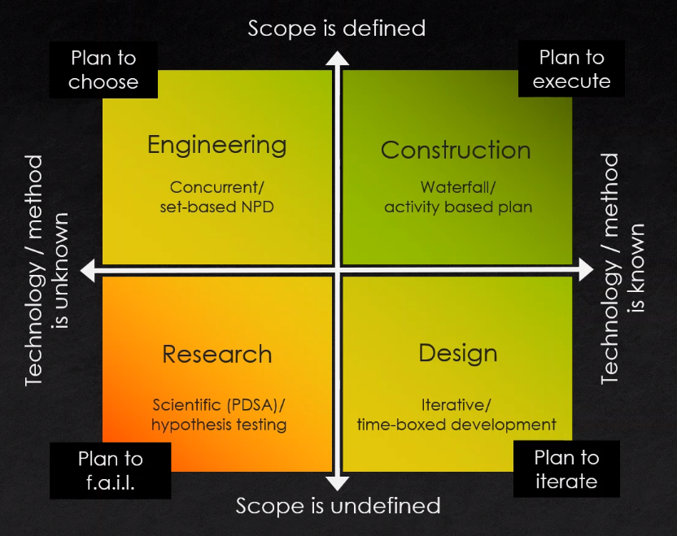

Kaip padidinti projektų sėkmės tikimybę ir greitį?
naudoti geriausias praktikas/standartus
valdyti rizikas: sėkmės tikimybė=1-žlugimo tikimybė
naudoti lean thinking (atsisakyti resursų švaistymo)

Projektų valdymas: rizikų valdymas ir plano valdymas

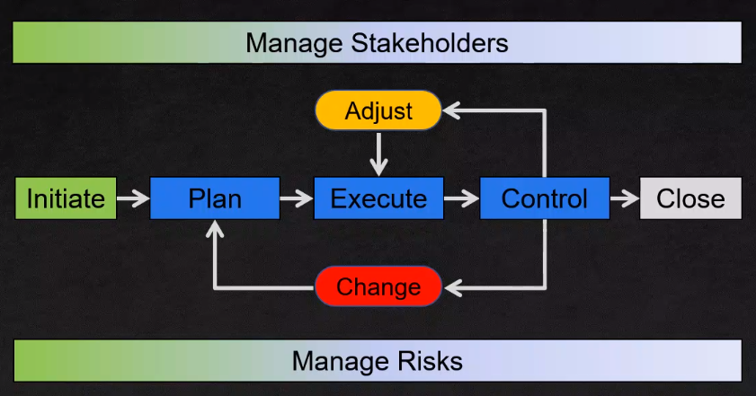

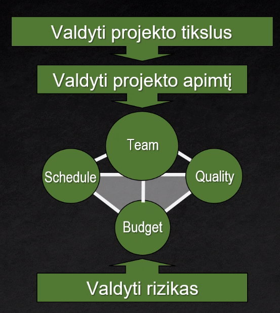

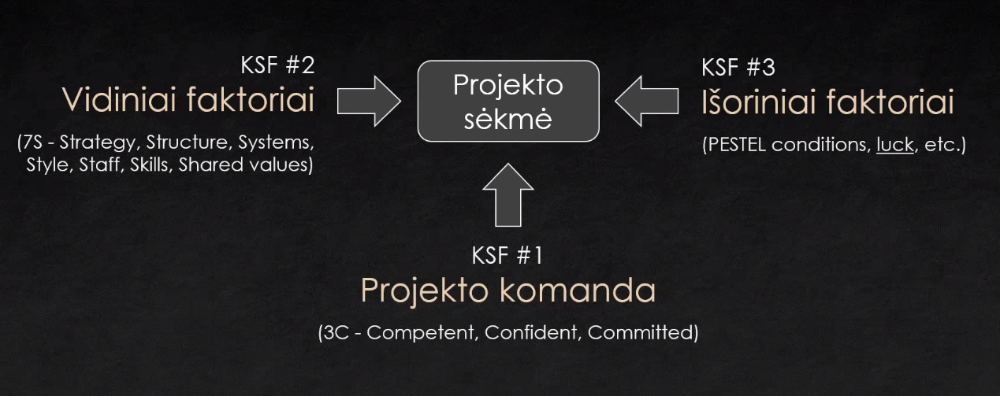

ProMoTe - project model for telia
1. divide into phases (CP)
   1. Project initiation
   2. Project planning
      1. L: software schedule/scope can change, expect it to change
   3. Project execution
   4. Project closure
2. identify and control stakeholders (CP)
   1. gather expectations
3. define organisation (CP)
4. templated documents (CP)
   1. project charter
   2. project plan
   3. stakeholder list
   4. progress reports
   5. final report

CP control points to get approval for further phases.

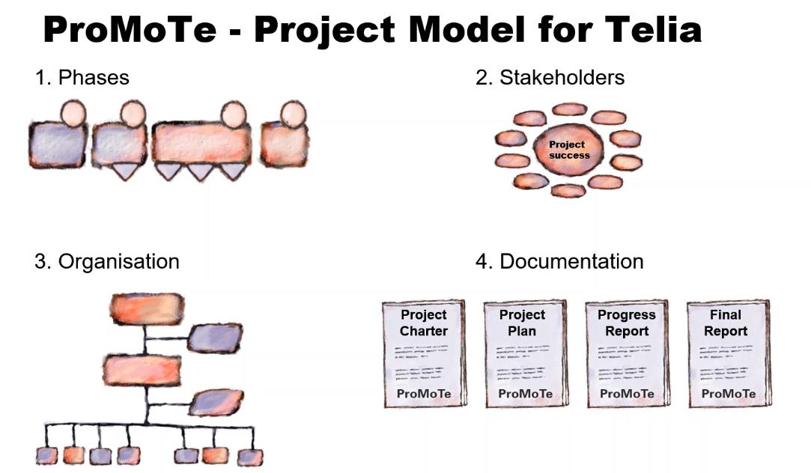

Stakeholders: customers, sponsor (define and accept project), manager (lead project to success), team (execute, monitor, report), owners, partners, suppliers, competitors, ...

"What is not on paper, was never said", do meeting minutes, agree on emails, aggregate to docs.

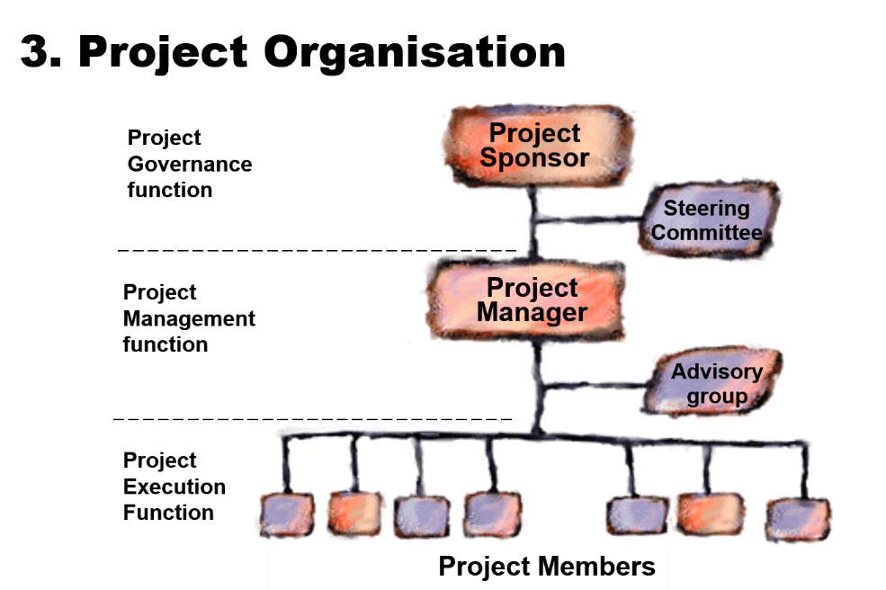

# Day 2

what is expected from project owner?
tikslo, vizijos
paramos resursais ir palaikymo organizacijoje
užtikrinti, kad projektas kuria naudą

projekto vadovas:
valdyti rizikas
būti adaptyvus
bring order to chaos
report bad news first

Responsibilities should be cleared up each time 51:00

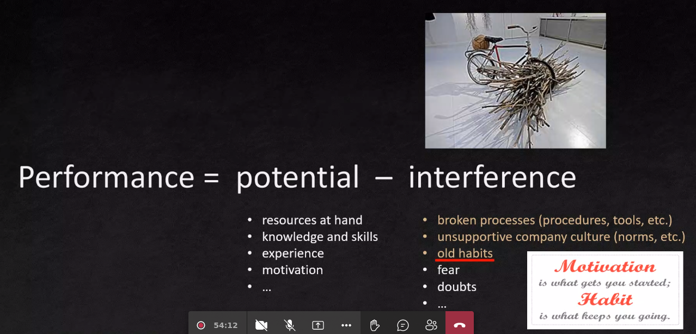
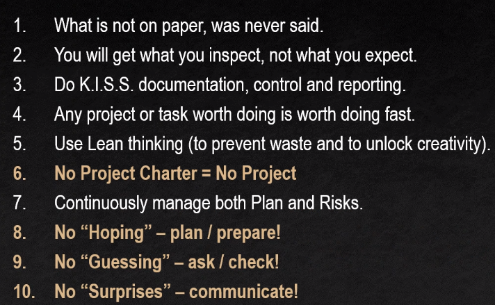

If you are surprised, your radars aren't working
If you surprise others, you communication is lacking.

PROMOTE
phases:
   1. Initiate project 
      1. define project
      2. set stakeholder expectations
      3. get authorisation and resources
      4. DOCUMENT: project charter 
         1. (theory: owned by project owner, practive: created by project manager)
         2. Prefer simple and short, 1 pager
         3. Standardised
         4. goal and results are related, but result is what is promised to the client, what you can "touch", goal is how that helps us in a bigger picture
         5. freedoms are for implementors to know where they can make decisions and use creativity
         6. out of scope is to control expectations
         7. don't write too much, too long, each item should have a practical reason to exist.
         8. risks: critical risks or very likely risks, does not have to include all risks, that is for risks registry
         9. costs, financial estimation does not have to be very precise, as it cannot be. It should be more of a guideline and monitored to make a decision if maybe the project is getting out of hand and is not worth it anymore.
         10. For parts that are very detailed and implementation specific can be added to a companion document with project charter.
      5. DOCUMENT: stakeholder register
   2. 

HAL: key result: ability to integrate new hardware at reasonable time and effort.

Programme - a series of projects that share the same goal.
Portfolio - a collection of individual projects and programmes that share common strategic purpose of the company.

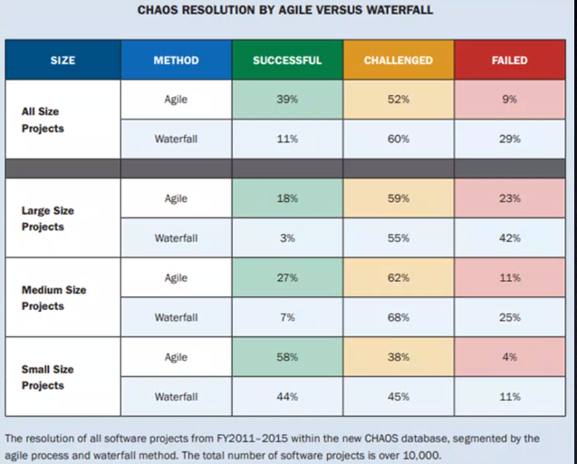

1:55 didžiuliia projektai yra planavimas failint
HAL dabartinis arch charter yra huge. Ar makes sense daryti planus metam? Kodėl ne quarter?

stakeholder concerns/needs/expectations should not be guessed

ProMoTe stages:
Project initiation
Project planning
   Goal: project scope
   Goal: SMART action plan, how to deliver within scope?
   Goal: get authorisation and commitment of resources
   Scope, schedule, cost
   Core team for planning
   Collect and document requirements from key stakeholders
      traceability matrix
      Who, what, why, ID to WBS, to make sure all requirements are covered.
      User stories
      Guess(X), ask, observe, run experiments
   Define project scope statement document (single page)
   Investigate alternative ways, solutions
   Create PBS, WBS
      PBS is product scope, where
      WBS is work scope, how (including project managing)
         granularity is to the scope where it is controlled
      responsibilities
   Create responsibility matrix, RACI/results RAPID/decisions
   Create risk register (risk - uncertainty that matters)
      Plan risk managements (responsibility matrix)
      Formulation: cause -> risk -> effect
      As a result of Covid19, team members can get sick, which would delay delivery.
      Risk register
      Use expert judgement for risk identification
      Risk treatment planning
      Contingency reserve is for accepted risks and should be added to budget
         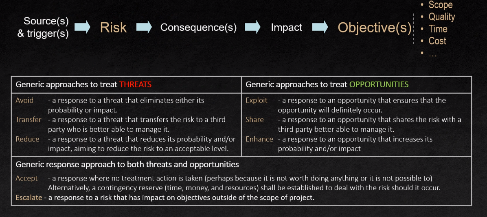
      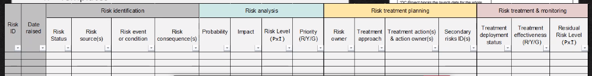
      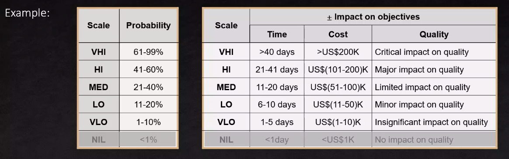
      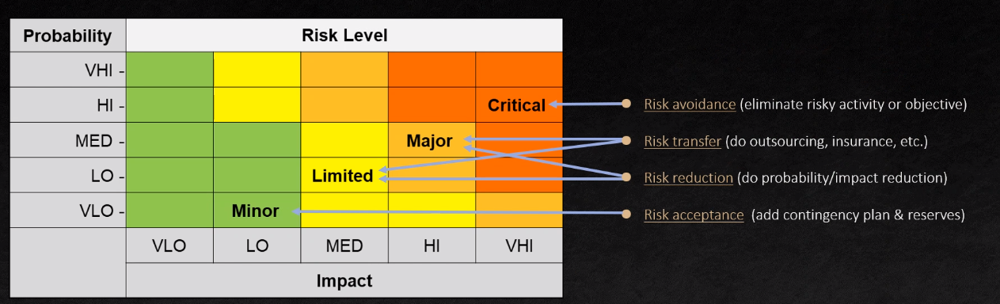
   Create schedule
   Crate budget
   Get approvals for scope, schedule, budget.
   ProjectSchedule (milestone/deadlines, gantt, detailed with dependencies and duration)
   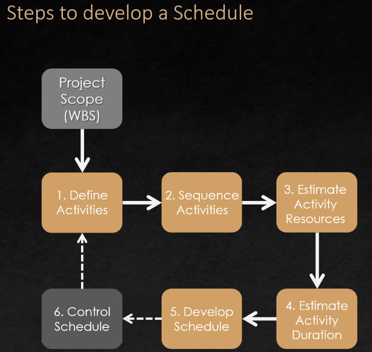
   Group decision: poker
   alternative -> Three point estimating: estimations should be pessimistic+optimistic+mostlikely
   expert judgement: educated guess
   Analoguos estimating: historic
   problems:
      queuing (waiting for resources)
      multitasking
      ...
Project execution
   ?Assemble the project core team (owner decides, leader recommends)
   Quality control, 
   quality can mean different things for different stakeholders ("he has an interesting quality around him")
   quality = performance / requirements
   (1)Lack of defects (2)Design -> (2.1) utility, (2.2) warranty
   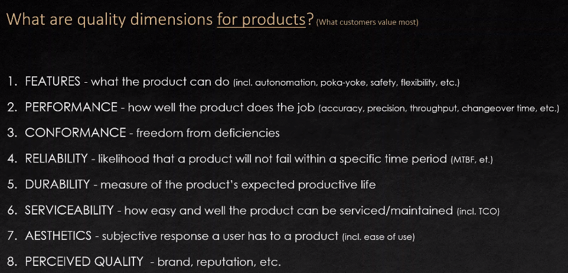
   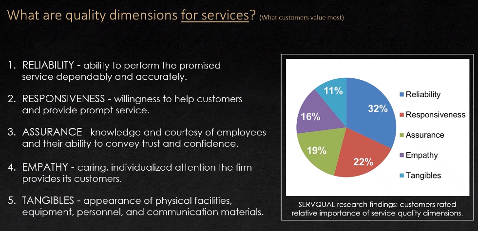
   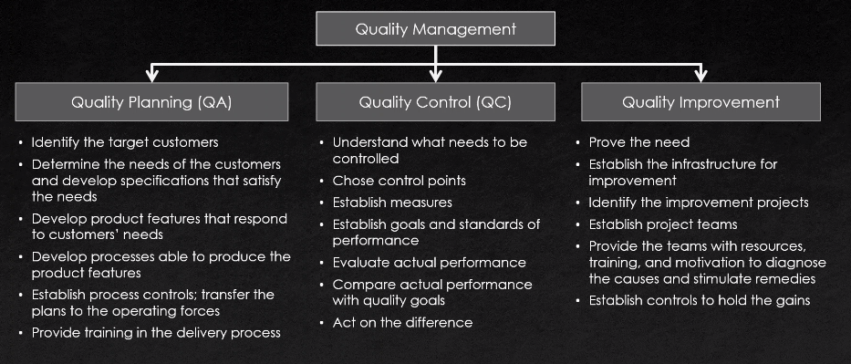

Project closure

report: (1)remind about project, (2) what was planned, (3) what was not done, (4) what was learned, (5) what decisions we need to make

Responsibility matrix
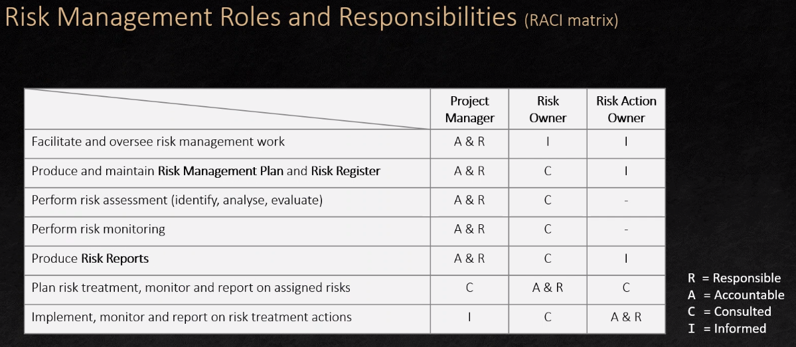

"WBS nekuriama dirbat Agile" 02:23
what is RAM?

WBS can be build iteratively using brainstorming
1. Add nodes randomly
2. try to structurize
3. try to decompose
repeat

HAL: waterfally-planning seems irrelevent, we need rework on sca, the plan doesn't change that and implementation plan will be implemented and modified iteratively, looking far into future seems of little relevance.

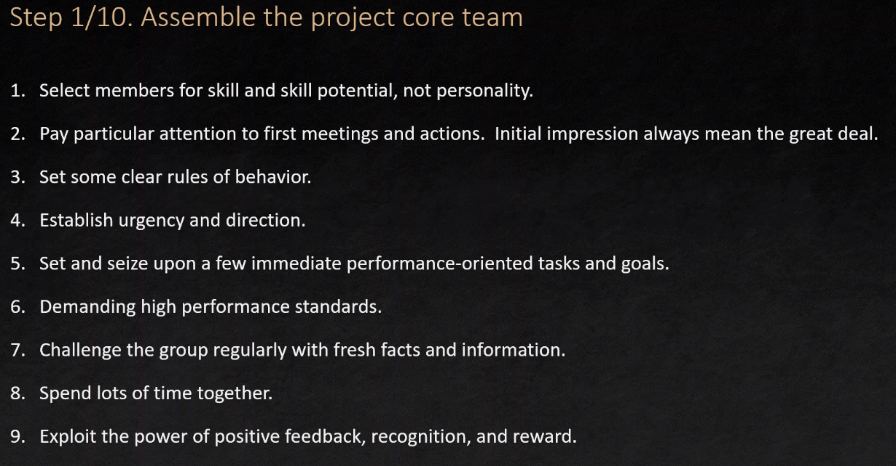

Scope priorities
Must have
Should have
Could have
Will not have
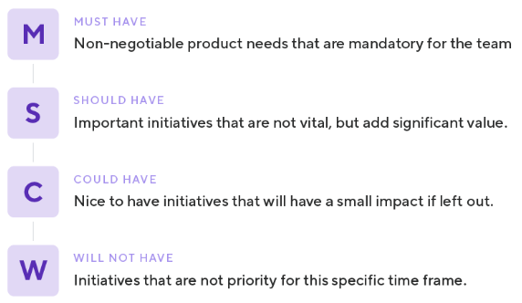

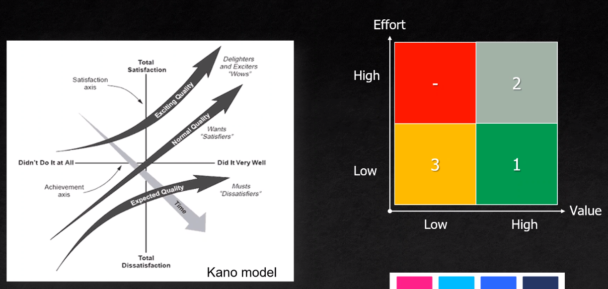
Expected quality is a must, but has very quick diminishing returns, so no need to add much effort.
Normal quality, normal linear corelation between satisfaction and effort
Exciting quality, wihtout it there is no dissatisfaction, but effort increases satisfaction by a lot.

DICE = D + (2*I) + (2*C1) + C2 + E
.png)

norėtųsi paprastesnių etapų, po mažiau informacijos, kad įvaldytumėm tai ir tik tada eitumėm prie sekančio. Now I am a bit hesitant to think that we will manage to do all that we heard and not only do it by consulting the material, but actually get a hold of it and get use out of it.

this whole waterfally project management makes the organization feel very divided.
I didn't feel this divided when I worked in a bank with thousands of employees, hundreds of departments.

why projects are late?
   - queuing, each task being late acumulates fown the chain of dependency
   - 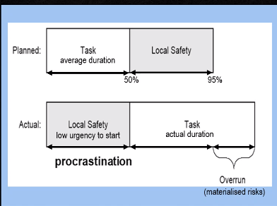
   - ( O + 4M = P ) / 6
   - 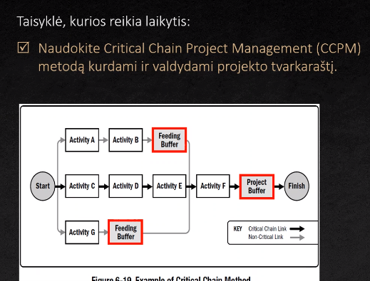
   - buferis kritinės grandies ilgio
   - starting projects at an agreed time is just as important or more important than finishing project on time, because it influences it.
   - once started, the work should be finished as soon as practically possible
   - buffers should be used for unexpected, not multitasking

Project managment is a full-time role, I probably cannot mix it with technical lead/developer responsibilities, but knowing the process can make it easier for me to collaborate with project managers.

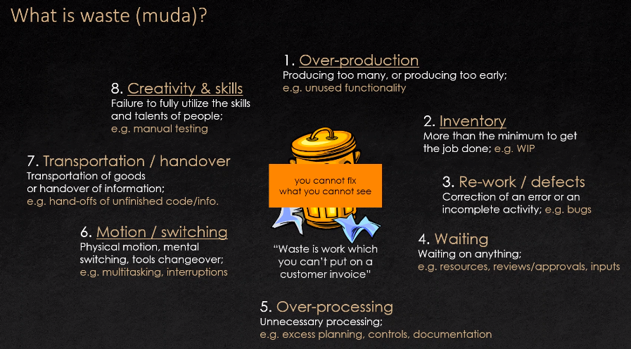

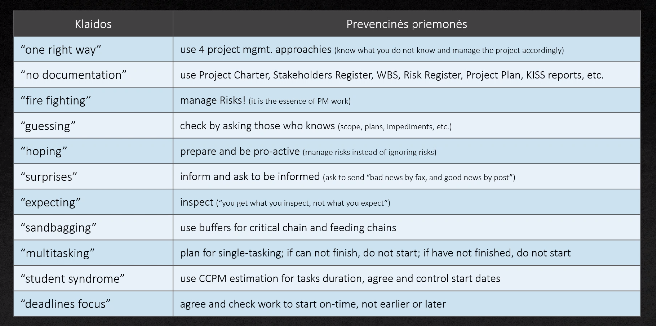
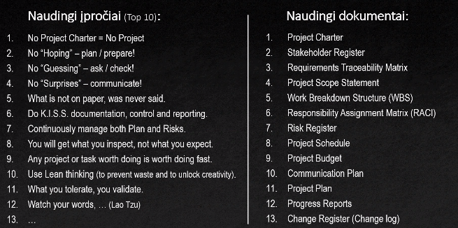
